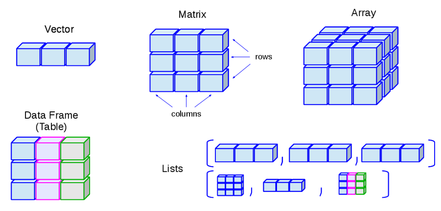
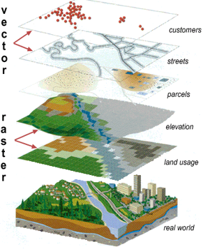
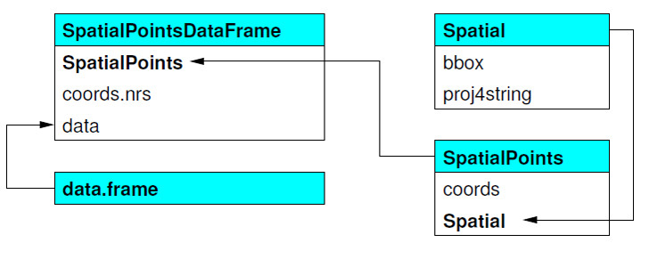
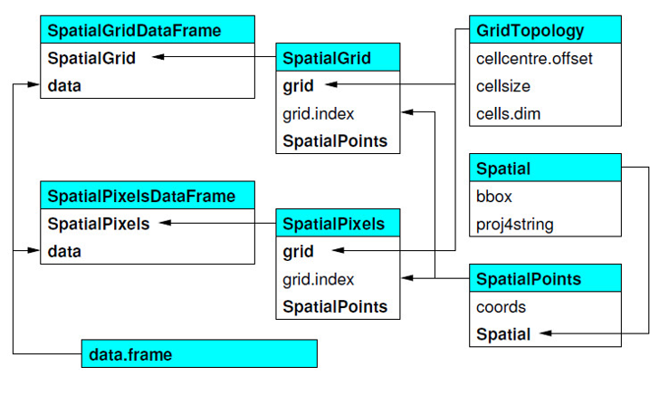
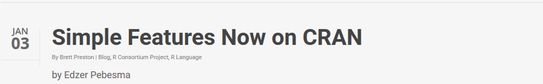

```{r , echo=FALSE, warning=F, message=F}
old <- Sys.localeconv()
options(OutDec= ",")
if (Sys.getenv("JAVA_HOME")!="")
Sys.setenv(JAVA_HOME="")
library(xlsx)
library(rgeos)
library(spdep)
library(png)
library(knitr)
library(spatstat)
library(sf)
library(geosphere)
library(maptools)
library(sp)
library(leaflet)
library(RColorBrewer)
library(rgdal)
library(leaflet)
#library(webshot)
library(grid)
library(png)
library(spacetime)
setwd()
```


## What is R?

<div class="columns-2">

  * a programming **language** and **environment** for statistical analysis and visualisation
  
  * open-source == large community 
  
  * great number of contributed packages (diverse disciplines)
  

  
```{r fig.width=3.4, fig.height=3.4,echo=FALSE}
img <- readPNG("Rlogo.png")
grid.raster(img)
```

</div>
    
<div class="columns-1">  

## CRAN 

https://cran.r-project.org/

https://cran.r-project.org/web/packages/available_packages_by_name.html

https://CRAN.R-project.org/view=Spatial


https://cran.r-project.org/web/views/SpatioTemporal.html


## CRAN "Spatial" - three general types of packages


Packages specialised for:

1) accessing geodata and other software functions, interoperability

2) visualisation of geodata

3) analysis of geodata


## 1) Packages for access and interoperability


* Geospatial Data Abstraction Library (GDAL): *rgdal*

* GRASS GIS: *spgrass6* 

* SAGA GIS: *RSAGA*

* Access, PostgreSQL/PostGIS: *RODBC*, *rpostgis*, *postGIStools*

* ...


## 2) Packages for geodata  visualisation 

  
  * rasterVis
  
  * maps
  
  * plotKML
  
  * plotGoogleMaps
  
  * ...
  
  * (also, base, lattice and ggplot general packages)
  

Much more on GitHub
======================================================== 

## 2) Packages for analysis 


 * point patterns: spatial, spatstat
  
 * geostatistics (2D/3D), likelihood approach, Bayes methods: *geoR*, *gstat*, *RandomFields*
  
 * 2D carthesian geometry operations: *Rgeos*

 * circular, directional statistics: *circular*
  
 * cluster's detection: *Dcluster*

 * analytics on greeded data: *raster*

 * geometry on the sphere, great circle analyses: *geosphere* 

 * remotely sensed data: *remotesensing*
 
 * ...


## Basic data types in R


```{r , echo=FALSE ,  esults='asis', message=F, comment=NA, cache=F}
#print(read.xlsx("strukture_podataka.xlsx", as.data.frame=T, stringsAsFactors = F,  sheetIndex=1, encoding="UTF-8" ), cex=0.5)

x <- read.xlsx("strukture_podataka.xlsx", as.data.frame=T, stringsAsFactors = F,  sheetIndex=1, encoding="UTF-8" )
options(knitr.kable.NA = '')
kable(x, format = "pandoc", align=c(rep('c', 1), rep('r', 2)), col.names=c("N dimensions", "Homogenious", "Heterogenious"), row.names=F)
```


## R, object oriented language 


{width=50%}	


## But we need a model of the real world

<div class="columns-2">
	

points, lines, polygons

</div>

## "Spatial" in R, short history

* pre-2003, sporadic 

* 2003: workshop at DSC

* 2003: start of *r-sig-geo*

* 2003: *rgdal* on CRAN

* 2005: *sp* on CRAN; *sp* support in *rgdal*


## "Spatial" in R, short history 2

* 2008: *Applied Spatial Data Analysis with R*

* 2011: *rgeos* on CRAN

* 2013: second edition of Applied Spatial Data Analysis with R

* 2016-7: simple features for R (finished?)

* 2017-8: spatiotemporal tidy arrays for R (design phase)


## Package 'sp' 

First package for classes and methods for spatial data in R

* classes and methods for geo data in R/S language 

* does not provide any analytical methods 

* S4 data class

* generic methods for **points**, **lines**, **polygons** and **grids**/**surfaces**
 


## Clases in 'sp' - vector, example for points


Data structure for points

	


## Clases in 'sp' - rasters/grids

Data structure for grids

	

## General structure Spatial*DataFrames

* @data - data.frame, attributes 
 
* @coords.nrs - variables in data.frame with coordinate info

* @coords - coordinates

* @bbox - spatial extent 

* @proj4string - spatial reference


## Methods for 'sp' classes

* dimensions(x) 

* spTransform(x, CRS)

* bbox(x) 

* coordinates(x) 

* gridded(x) 

* spplot(x) 

* over(x, y)  

* spsample(x) 

* geometry(x) 


## Simple features - CRAN

Package 'sf' 



## Why 'sp' was not enough?

But still no support for gridded data!

```{r , fig.width=8, fig.height=5, echo=FALSE ,  esults='asis', message=F, comment=NA, cache=F}
opar <- par(mfrow = c(1, 2))
a <- st_polygon(list(cbind(c(0,0,7.5,7.5,0),c(0,-1,-1,0,0))))
b <- st_polygon(list(cbind(c(0,1,2,3,4,5,6,7,7,0),c(1,0,.5,0,0,0.5,-0.5,-0.5,1,1))))
plot(a, ylim = c(-1,1))
title("INTERSECT")
plot(b, add = TRUE, border = 'red4')
i <- st_intersection(a,b)
plot(a, ylim = c(-1,1))
title("GEOMETRYCOLLECTION")
plot(b, add = TRUE, border = 'red4')
plot(i, add = TRUE, col = 'darkgreen', lwd = 2)
par(opar)
```


## OGC/ISO - simple features

Simple feature hierarchy

```{r fig.width=7, fig.height=5,echo=FALSE}
rm(img)
img <- readPNG("Figure-4-OGC-Simple-Feature-Specification-38.png")
grid.raster(img)
```


## Simple features?

* ISO standard that is widely adopted
* used in spatial databases
* _feature_: abstraction of real world phenomena
* _simple feature_: feature with all geometric attributes described piecewise by straight line or planar interpolation between sets of points 
* 7 + 10 types, 68 classes, 7 classes ok for 99% of the use cases
* text and binary serialisations (WKT, WKB)
* support for mixed type (`GEOMETRYCOLLECTION`), and type mix (`GEOMETRY`)
* support for empty geometry 


## Before 'sf' package

Simple feature objects automatically imported as 'sp' object using package *rgeos*

```{r , fig.width=5, fig.height=5,echo=T, message=F}
library(rgeos)
my_poly <- readWKT("POLYGON((1 0,0 1,1 2,2 1,1 0))")
plot(my_poly, main="WKT defined polygon")
```


## Start preparing spatial objects from...

Not usual way to prepare geodata this way


```{r , echo=T, message=F}
#polygons from set of coordinates
Sr1 <- Polygon(cbind(c(2, 4, 4, 1, 2), c(2, 3, 5, 4, 2)))
Sr2 <- Polygon(cbind(c(5, 4, 2, 5), c(2, 3, 2, 2)))
Sr3 <- Polygon(cbind(c(4, 4, 5, 10, 4), c(5, 3, 2, 5, 5)))
Sr4 <- Polygon(cbind(c(5, 6, 6, 5, 5), c(4, 4, 3, 3, 4)), hole = TRUE)
Srs1 <- Polygons(list(Sr1), "s1")
Srs2 <- Polygons(list(Sr2), "s2")
#several polygons into list
Srs3 <- Polygons(list(Sr4, Sr3), "s3/4")
#create spatial polygons, still no CRS/SRID
SpP <- SpatialPolygons(list(Srs1, Srs2, Srs3), 1:3)
```


## Inspect the data...

Stil necessary to attach *Spatial* information (CRS/SRID) and optionally attributes *data.frame*

```{r , fig.width=6, fig.height=5,echo=T, message=F}
plot(SpP)
```


## Interactive visualisations with Leaflet

... still no CRS/SRID but we can visualise it in different ways

```{r, echo=T}
n <-leaflet()
leaflet(height = "300px") %>% addPolygons(data = SpP)
```


## More usually, import the geodata 

Import via GDAL/OGR library


```{r, echo=T, comment=NA}
HRV_adm2 <- readOGR(getwd(),"HRV_adm2", verbose = TRUE, stringsAsFactors=FALSE, encoding="UTF-8")
#take a look from how many level 1 administrative division
levels(as.factor(HRV_adm2@data$ID_1))
```

## Manipulate geodata

Diverse functions from Geos library

Access functionality of other GIS software

Result exported via Rgdal (GDAL/OGR library)


## Manipulate geodata

```{r ,echo=T, comment=NA}
library(maptools); 
head(HRV_adm2@data[1:6], n=2)
#levels of variable, ID for county
levels(as.factor(HRV_adm2@data$ID_1))
#make union of polygons, union by county ID
HRV_adm2_union <-  unionSpatialPolygons(HRV_adm2, HRV_adm2@data$ID_1)
```

## Visualise the result


```{r fig.width=6, fig.height=5,echo=T}
plot(HRV_adm2_union, col="aliceblue", main="Union of polygons")
box(lty = 'solid')
```


## Integrate data

Attach data from other sources, e.g. Bureau of Statistics

```{r eval=T, comment=F, echo=T}
HRV_adm1 <- readOGR("D:\\podloge\\GADM\\Croatia\\HRV_adm_shp","HRV_adm1", encoding="Windows-1250",verbose = F, stringsAsFactors=FALSE)

data <- read.xlsx("county_fake_data.xlsx", 
                     as.data.frame=T, stringsAsFactors = T,  
                     sheetIndex=1, encoding="UTF-8" )
#merge by spatial polygons
merged_data <- merge(HRV_adm1, data, by.x="ID_1", by.y="ID_COUNTY", all.x=T)
```

## Visualise the result

```{r eval=F,echo=F} 
png("merged_data.png", width=10, height=10, units="cm", res=300 )
plot(merged_data[13], col=colorRampPalette(brewer.pal(5,"Blues"))(21),
       axes=T, main="Variable NO")
invisible(dev.off())
```


```{r eval=F, fig.width=7, fig.height=5,echo=T} 
plot(merged_data[13], col=colorRampPalette(brewer.pal(5,"Blues"))(21),
       axes=T, main="Variable NO")
```


```{r eval=T, fig.width=7, fig.height=5,echo=FALSE}
rm(img)
img <- readPNG("merged_data.png")
grid.raster(img)
```


## Example, select Lobor and Oroslavje 


```{r ,echo=T, comment=NA}
head(HRV_adm2@data[1:4], n=2)
select <- HRV_adm2[HRV_adm2@data$NAME_2=="Lobor" | HRV_adm2@data$NAME_2=="Oroslavje",]
class(select)
#prepare random sample in selection
p_100 <- spsample(select,100, "random") 
```

## Visualise the result

```{r echo=T,fig.width=8, fig.height=5,eval=T, results = 'asis', comment = NA, cache = F}
plot(select, main="Lobor and Oroslavje")
points(p_100, pch=15, cex=0.9, col="green4")
```


## Export some elements

Export selected polygons as Esri shapefile, KML, PostgreSQL/PostGIS...

```{r eval=F,echo=T}
writeOGR (select, ".", "Lobor_Orosavje", driver="ESRI Shapefile", overwrite=T)
writeOGR (select, "Lobor_Orosavje.kml", ".", driver="KML", overwrite=T)
writeOGR(select, "PG:dbname=GEO_meetup", layer_options = "geometry_name=geom", "states", "PostgreSQL")
```


## Example: additional customisation for Leaflet


```{r eval=F, echo=T, results = 'asis', comment = NA, cache = F}
HRV_adm0 <- readOGR("D:\\podloge\\GADM\\Croatia\\HRV_adm_shp","HRV_adm0", verbose = F, stringsAsFactors=FALSE, encoding="UTF-8")
HRV_adm1 <- readOGR("D:\\podloge\\GADM\\Croatia\\HRV_adm_shp","HRV_adm1", verbose = F, stringsAsFactors=FALSE, encoding="UTF-8")
HRV_adm2 <- readOGR("D:\\podloge\\GADM\\Croatia\\HRV_adm_shp","HRV_adm2", verbose = F, stringsAsFactors=FALSE, encoding="UTF-8")
#create icon
rest_icon <- makeIcon(
  iconUrl = "R_logo.png",
  iconWidth = 12, iconHeight = 12,
  iconAnchorX = 15, iconAnchorY = 10)
#make our own pallette
colors<- colorRampPalette(brewer.pal(5,"Blues"))(21)
#points to visualise
load("df.RData")
#make it spatial
coordinates(df) <- ~ lng+lat
#what is CRS?
proj4string(df) <- CRS("+proj=longlat +datum=WGS84") #EPSG:4326
```

## Our data in Leaflet

```{r eval=F, echo=T, results = 'asis', comment = NA, cache = F}
m <- leaflet()  %>% addTiles()
m<- m %>% addPolygons(data=HRV_adm1, fillColor = colors, stroke = F, fillOpacity = 0.5,weight=3)
m<- m %>% addPolygons(data=HRV_adm0, fill=F, color="#f93", stroke = T, fillOpacity = 0.5,weight=1)
m<- m %>% addPolygons(data=HRV_adm2, fill=F, color="gray", stroke = T, fillOpacity = 0.5,weight=1)
m<- m %>% addMarkers(coordinates(df)[,1],coordinates(df)[,2],  icon = rest_icon)
m
library(htmlwidgets)
saveWidget(m, file="m.html")
```


## Use capture from Leaflet for dynamic documents from RMarkdown


{width=50%}	

## Gridded data in 'sp'
Again, we can create objects, here start from grid topology definition

```{r echo=T,eval=T, results = 'asis', comment = NA, cache = F}
topology <- GridTopology(cellcentre.offset = c(1,1,2), cellsize=c(1,1,1), cells.dim = c(3,4,6)) #cellcentre.offset 	numeric; vector smin coordinates of cell centre in each dim 
sp_grid <- SpatialGrid(topology)
summary(sp_grid)
```

## What we have made so far

```{r echo=F,fig.width=8, fig.height=5,eval=T, results = 'asis', comment = NA, cache = F}
plot(sp_grid, axes=TRUE, main="Grid from topology")
points(coordinates(topology), pch=20)
```

## Create Grid object from points

Start to build objects from grid topology, coordinates or read gridded data

```{r ,echo=T, comment=NA}
points_grid <-  expand.grid(x = 1:3, y = 1:4) 
sp_points_grid <- SpatialPoints(points_grid)
```

## Visualize prepared grid
```{r echo=F,fig.width=8, fig.height=5,eval=T, results = 'asis', comment = NA, cache = F}
plot(sp_points_grid, axes=T, xlim=c(0, 4), ylim=c(0,5), main="SpatialPoints object")
```

## Continuation to full grid

```{r ,echo=T, comment=NA}
#from SpatialPoints SpatialPixels
pix_grid <- SpatialPixels(sp_points_grid)
#or this way object gridded (SpatialPoints into SpatialPixels)
class(sp_points_grid)
gridded(sp_points_grid) <- T
#is objet full grid?
fullgrid(pix_grid)  
```


## Continuation to full grid

```{r ,echo=T, comment=NA}

#set for TRUE and create SpatialGrid
fullgrid(pix_grid) <- T
#add atributes (data.frame), to spatial components
atr_grid <- data.frame(matrix(1:12)) #data.frame
my_grid <- SpatialGridDataFrame(pix_grid,  atr_grid)
```


## Visualize prepared grid

```{r echo=F,fig.width=8, fig.height=5,eval=T, results = 'asis', comment = NA, cache = F}
spplot(my_grid, col.regions=terrain.colors(100), main="SpatialGridDataFrame")
```


## Import gridded data with *sp* package

Common way of importing gridded data; calculate summary statistics...

```{r echo=T,eval=T, results = 'asis', comment = NA, cache = F}
dem <- readGDAL ("dem_1k.asc")
#summary statistics
summary(dem@data$band1)
```

## With all types of spatial data, statistical procedures from R

As example plot histogram of elevation values


```{r echo=F,fig.width=8, fig.height=5,eval=T, results = 'asis', comment = NA, cache = F}
hist(dem@data$band1, main="Histogram of elevation values", col="lightblue")
```

## Prepare additional data, spTransform

When data not on the same CRS

```{r echo=T,eval=T, results = 'asis', comment = NA, cache = F}
ETRS_LEA <- CRS("+proj=laea +lat_0=52 +lon_0=10 +x_0=4321000 +y_0=3210000 +ellps=GRS80 +units=m +no_defs")
#sp transform to European equal area projection as dem
HRV_adm1_ETRS <- spTransform(HRV_adm1, ETRS_LEA)

#spatial extents
bbox(HRV_adm1_ETRS)
bbox(dem)
```

## Visualise gridded data with attributes

```{r echo=F,fig.width=7, fig.height=5,eval=T, results = 'asis', comment = NA, cache = F}
spplot(dem, col.regions=terrain.colors(100),   main="Digital elevation model") 
```


## Export as ...

ESRI asc, SAGA sgrd...

```{r echo=T,eval=F, results = 'asis', comment = NA, cache = F}
writeGDAL(dem, fname="dem.asc", drivername="AAIGrid",  mvFlag=99999)
writeGDAL (dem, fname= "dem.sdat",  drivername="SAGA") 
writeGDAL (dem, fname="dem", drivername="GSBG")
```

## Gridded data with *raster* package

Extremely popular for analysis of big rasters

Data does not need to be in memory

Easy shift to 'sp' classes

Extract wanted spatial extent or aggregate by polygon, select on points...

Import gridded data from Worldclim database, minimal temperature

## Get data from Worldclim database - *raster* object

```{r echo=T,fig.width=8, fig.height=5, results = 'asis', comment = NA, cache = F}
library(raster)
getData('worldclim', var='tmin', res=0.5, lon=5, lat=45)
```


## Plot *raster* object

```{r echo=F,fig.width=8, fig.height=5,eval=T, results = 'asis', comment = NA, cache = F}
plot(getData('worldclim', var='tmin', res=0.5, lon=5, lat=45))
```

## Extract values for polygons

Values of Digital elevation model for each county

```{r echo=T,eval=T, results = 'asis', comment = NA, cache = F}
dem_r <- raster(dem)
#extracted values for each 1 km cell in polygons
#object of class list, length 21, as many counties
dem_county <- extract(dem_r, HRV_adm1_ETRS)
```


## R specific loops

Ask for maximal value of elevation by county

```{r echo=F,eval=T, results = 'asis', comment = NA, cache = F}
lapply(dem_county, max)
```


Static map Visualisation example
========================================================


## Example: static map - locally stored data 

First we need to prepare data

```{r eval=T, echo=T, results = 'asis', comment = NA, cache = F}
#import geo data into R
library(rgdal)
#read via GDAL/OGR
W <- readOGR(getwd(),"TM_WORLD_BORDERS-0.3", verbose = F, stringsAsFactors=FALSE) 
```


## Inspect the data

```{r eval=T,fig.width=8, fig.height=5, echo=T, results = 'asis', comment = NA, cache = F}
#inspect CRS/SRID
W@proj4string
#take a look at the data
head(W@data[1:5], n=1)
```


## Base graphic system, static map 

```{r results = 'asis', comment = NA, cache = F}
plot(W, main="Hello World")  
```


## Base graphics

Zoom, additional improvements

```{r eval=F, echo=T, results = 'asis', comment = NA, cache = F}
#create gridlines
grat <- gridlines(W, easts=seq(-40,20,by=5), norths=seq(10,80,by=5), ndiscr = 20)
#zoom to specified spatial extent on plot
plot(W, xlim=c(-30,30), ylim=c(30,58)) 
#add gridlines
lines(grat, lty=2)
#add title
title(main="My map with zoom", sub="Gridlines added")
```


## Static map

```{r eval=T,fig.width=8, fig.height=5, echo=F, results = 'asis', comment = NA, cache = F}
#create gridlines
grat <- gridlines(W, easts=seq(-40,20,by=5), norths=seq(10,80,by=5), ndiscr = 20)
#zoom to specified spatial extent on plot
plot(W, xlim=c(-30,30), ylim=c(30,58)) 
#add gridlines
lines(grat, lty=2)
#add title
title(main="My map with zoom", sub="Gridlines added")
```

## Base graphic, different adjustments

Prepare additional objects to be plotted

```{r eval=T, echo=T, results = 'asis', comment = NA, cache = F}
load("df.RData") #load data.frame saved in R format
#create spatial objects from data.frame
coordinates(df) <- ~ lng  + lat
#define CRS to the points
#World Geodetic System - WGS
proj4string(df) <- CRS("+proj=longlat +datum=WGS84") #EPSG:4326
#colors(2)
col_2 <- colors()[351]
x <-Polygon(cbind(x=c(13.9, 20.2, 20.2, 13.9), y=c(42.5, 42.5,46.5, 46.5)))
```

## Improved map

```{r echo=T, eval=F,fig.width=8, fig.height=5, results = 'asis', comment = NA, cache = F}
plot(W,  col=col_2, xlim=c(13.9, 19.6), ylim=c(42.5, 46.5), main="Hello Croatia", lwd=2,  axes=F,  xlab="Longitude", ylab="Latitude")

#add points
points(df,  pch=22, cex=0.75, col="yellow")

axis(1, col.axis = "dark gray")
axis(2, col.axis = "dark gray")
box(lty = 'solid', col = 'light gray')
text(x=14.7, y=46, labels="AUSTRIA", cex=0.75)       
text(x=17.8, y=44.5, labels="BOSNIA AND HERZEGOVINA", cex=0.75)   
text(x=18, y=46.4, labels="HUNGARY", cex=0.75) 
text(x=19.2, y=42.7, labels="MONTENEGRO", cex=0.75)
```

## Improved map

```{r echo=F,fig.width=8, fig.height=5,eval=T, results = 'asis', comment = NA, cache = F}
plot(W,  col=col_2, xlim=c(13.9, 19.6), ylim=c(42.5, 46.5), main="Hello Croatia", lwd=2,  axes=F,  xlab="Longitude", ylab="Latitude")

#add points
points(df,  pch=22, cex=0.75, col="yellow")

axis(1, col.axis = "dark gray")
axis(2, col.axis = "dark gray")
box(lty = 'solid', col = 'light gray')
text(x=14.7, y=46, labels="AUSTRIA", cex=0.75)       
text(x=17.8, y=44.5, labels="BOSNIA AND HERZEGOVINA", cex=0.75)   
text(x=18, y=46.4, labels="HUNGARY", cex=0.75) 
text(x=19.2, y=42.7, labels="MONTENEGRO", cex=0.75)
```


## Leaflet example, point marker


```{r , echo=T, message=F}
m <- leaflet()
m <- addTiles(m)
m <- addMarkers(m, lng=  15.970281, lat= 45.793467, popup="Plazza centar")
m
```


## Leaflet example, polygons


```{r , echo=T, message=F}
m <- leaflet()
m <- addTiles(m) %>%
addPolygons(data=select,color = "#03F", weight = 5, opacity = 0.5,)
m
```


## Example: data from MS Access 

```{r eval=T, echo=F, results = 'asis', comment = NA, cache = F}
load("galeb_52_3d.RData")
```

```{r eval=F, results = 'asis', comment = NA, cache = F}
#connect to the DB
ptice.db <-odbcDriverConnect("ptice_gps.mdb")

#SQL query
galeb_52 <- sqlQuery(ptice.db, query="SELECT  (latitude) AS lat, (longitude) AS lon , gps_fixstatus ,altitude, date_time
	FROM galebovi_2008
	WHERE serijski_broj = 52")

galeb_52_3d <- galeb_52[which(galeb_52$gps_fixstatus == '3D'),] 
str(galeb_52_3d)
```

## Create 'spacetime' class object - package 'spacetime'

```{r eval=T, echo=T, results = 'asis', comment = NA, cache = F}
sp <- SpatialPoints(galeb_52_3d[,c("lon","lat")])
proj4string(sp) <- CRS("+proj=longlat +datum=WGS84")
library(spacetime)
galeb_52_3d.st <- STIDF(sp, time = galeb_52_3d$date_time, data = galeb_52_3d)

#select and sort by time
galeb_52_3d.st_600   <- galeb_52_3d.st[1:600,]

#shepe of an icon
shape <- "R_logo.png"

#export as kml
library(plotKML)
kml(galeb_52_3d.st_600, labels = date_time, colour = altitude,shape=shape, colour_scale=rep("#FF00FF", 2), kmz = F)
```


## Example: data from PostGres/PostGIS

```{r eval=F,results = 'asis', comment = NA, cache = F}
library(RPostgreSQL) #R / PostgreSQL connect
library(RODBC) #connect to diff ODBC DB
library(rpostgis) #additional functionality for PostgreSQl/PostGIS
drv <- dbDriver("PostgreSQL")
con <- dbConnect(drv, user="postgres",  dbname = "GEO_meetup", host = "PostgreSQL9.6(localhost:5432)", password="*****")
dbListTables(con)
HRV_adm1 <- "SELECT * FROM HRV_adm1*)
dbDisconnect(con)
```


## Examples of analysis

Nearest neighbourgs, k=2; library(spdep)


```{r echo=t, eval=T,results = 'asis', comment = NA, cache = F}
library(spdep)
HRV_adm2_nn2<-knearneigh(coordinates(HRV_adm2), k=2) 
```

## Visualisation of neighbours

```{r echo=T,fig.width=7, fig.height=5,eval=T, results = 'asis', comment = NA, cache = F}
plot(HRV_adm2, border="darkgrey", axes=T)
plot(knn2nb(HRV_adm2_nn2), coordinates(HRV_adm2), add=TRUE, col="darkseagreen")
title(main="K nearest, k = 2")
```

## Analysis of point pattern

```{r eval=T,results = 'asis', comment = NA, cache = F}
p_HR_300 <-  spsample(HRV_adm2,300, "random") 
class(p_HR_300)
points_ppp <- as.ppp(p_HR_300) #create point pattern
points_ppp
den_10000 <-  density(points_ppp, 10000) #density of point pattern at 10000 m
summary(den_10000)#summary of the result
```

## Visualisation of result, export is necessary

```{r echo=T,fig.width=8, fig.height=5,eval=T, results = 'asis', comment = NA, cache = F}
plot(density(points_ppp), main="Intensity of point process", col=gray(0:40/40))
points(p_HR_300,  cex=1.2, pch=19, col="darkred",add==T)
```

## Library *geosphere*

```{r echo=T,eval=T,  comment = NA, cache = F}
pts <- SpatialPoints(data.frame(x = c(8.33, 30), y = c(47.22, -23)))
proj4string(pts) <- CRS("+proj=longlat +datum=WGS84")

# compute the great-circle
gcLine <- greatCircle(pts[1], pts[2], sp = TRUE)
```


## Visualising results

```{r echo=F,eval=F, results = 'asis', comment = NA, cache = F}
png("great-circle.png", width=10, height=10, units="cm", res=300 )
spplot(W[1], col.regions = "grey80", sp.layout = list(list("sp.lines", gcLine, 
    lwd = 2, col = "blue"), list("sp.points", pts, pch = 16, cex = 1.5, col = "red")), colorkey = FALSE, main="Great-circle trajectory")
invisible(dev.off())
```

```{r eval=F, echo=T, results = 'asis', comment = NA, cache = F}
spplot(W[1], col.regions = "grey80", sp.layout = list(list("sp.lines", gcLine, 
    lwd = 2, col = "blue"), list("sp.points", pts, pch = 16, cex = 1.5, col = "red")), colorkey = FALSE)
```

## Visualising results

```{r eval=T, fig.width=8, fig.height=5,echo=FALSE}
rm(img)
img <- readPNG("great-circle.png")
grid.raster(img)
```


## Call external software for some algorithm

Example calling SAGA GIS geoprocessor

Possible to have sevaral versions of SAGA, specify in the call

```{r eval=F, comment=F, echo=T}
library(RSAGA)
rsaga.get.modules(env = rsaga.env() )
myenv <-  rsaga.env(path="C:\\Program Files (x86)\\SAGA-GIS")
rsaga.get.modules(env=myenv)
rsaga.get.modules("shapes_polygons")
rsaga.get.usage("shapes_polygons", 2)
rsaga.geoprocessor (lib="shapes_polygons", 2, param=list(POLYGONS="my_shapefile.shp", OUTPUT="result_shapefile.shp", BAREA=T))
```


Thank you for your attention!
======================================================== 

